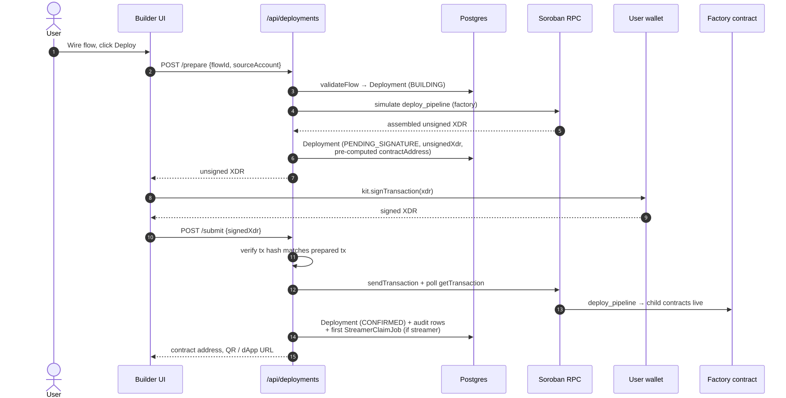
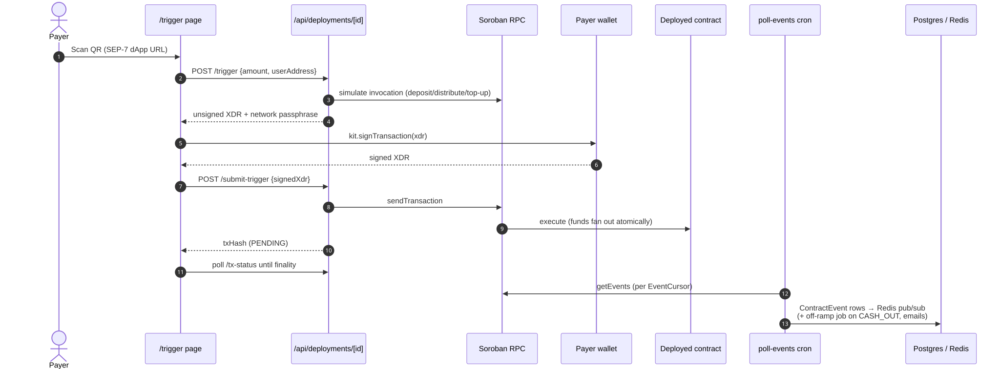
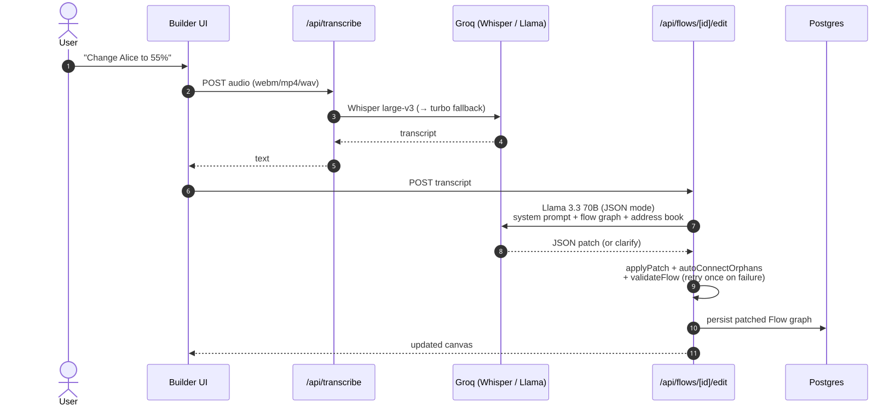
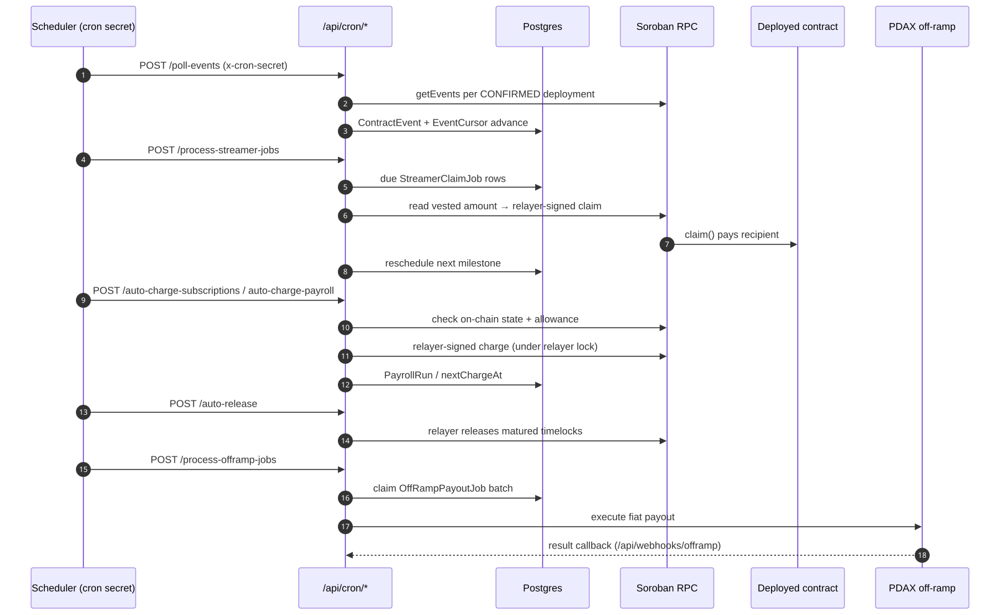

# Paiflow

> **Zaps for money.** A visual builder where you connect triggers (_"when this happens"_) to actions (_"pay this"_) and deploy a live Soroban contract on Stellar in under a minute.

Drag `On Receive USDC` → `Split 60/30/10` onto a canvas, hit **Deploy**, get a QR code. Anyone who scans it sends funds straight to a pre-audited smart contract that fans out the money automatically.

---

## Quick Links

[`Pitch Deck`](https://drive.google.com/drive/folders/1hFF9Y3ks-RBa4rNS5JzwVc7V5Z2Kw96J?usp=sharing) — sized for a 3-minute pitch.

[`Demo Video`](https://drive.google.com/drive/folders/1R4h7UaMfgEfIqhbSBqD3lzIs6hq5IaxP?usp=sharing) — 3-minute video showcasing the project.

[`Live App`](https://paiflow.xyz) — username: admin ; password: admin1234567

[`User Feedback Survey`](https://forms.gle/QTznHiqXCDEnJZq59) — help us improve Paiflow

[`Survey Responses`](https://docs.google.com/spreadsheets/d/1qpaEZPdl_vHMjrSe1Ld6OEMmiliarMKl-i4zdRtLIJQ/edit?usp=sharing) — view aggregated feedback

---

## 🌐 Testnet Deployments

All contracts are deployed on the **Stellar testnet**. Every flow deployed from the app produces a fresh set of pipeline contracts with deterministic addresses (via the factory's `deploy_pipeline`), and each deployment page in the UI deep-links its contracts to stellar.expert — the fastest way to see a live pipeline is to [deploy one in the app](https://paiflow.xyz) and click through.

**Factory contract** — deploys and wires every pipeline atomically:

| Contract                    | Address                                                                                                                                                                 |
| --------------------------- | ----------------------------------------------------------------------------------------------------------------------------------------------------------------------- |
| Factory (`deploy_pipeline`) | [`CBFZTEZZN2M7PV3LHM5TSHO6K45RDKT4ICX2YUNWRX6RXWVIOJ3KZJNK`](https://stellar.expert/explorer/testnet/contract/CBFZTEZZN2M7PV3LHM5TSHO6K45RDKT4ICX2YUNWRX6RXWVIOJ3KZJNK) |

**Template WASM uploads** — the pre-audited contract code the factory instantiates per deployment:

| Template           | Role      | WASM hash (testnet)                                                |
| ------------------ | --------- | ------------------------------------------------------------------ |
| Factory            | Deployer  | `3020bb44c41e358412e61565e0a132b16136b4414fc187afa628b968e6480023` |
| Deposit trigger    | Trigger   | `1719ae70773f7784eaab57f561c7e80176d808ff623b57bee48a00c72436ed18` |
| Webhook            | Trigger   | `415ecb61b53aee7805478e40e490328ea546e033f5b77bfe046aab956f28dd25` |
| Subscription       | Trigger   | `15a59ab78da2342900ce2f19d22ef3650a768e2c286fbf2e4bb2aba1790cf28f` |
| Splitter           | Action    | `201e4fcc924ecce5ef8ee17505fb82ce75751c72a5e23f9ff733d01dcd55c417` |
| Streamer           | Action    | `625cc073ec1ae4d6ed6f55d9f99c4d743153752b1d2667524123f8b0284c0467` |
| Payer              | Action    | `88c75f4f49f8ed0fedba08ce538811bd326ba51a0c7066b94ab9065cb16a82c2` |
| Payroll            | Action    | `055bb5c94bc0dac259f08a6adc97e9305fbf901d5facbdcbbedf799810f474bd` |
| Cash out           | Action    | `75ba6d8e71770bcbd98c1181473cca5d33d4646655c95786be8ed99155d77502` |
| Timelock           | Condition | `5529d368e5305f7688dd8d2d655fe48c4123be0110cdc9c167bce025d8d11c20` |
| Conditional        | Condition | `addd86767bd2691b26110b1c5fec071f48047ebc3ce7611a46a59b70c3329922` |
| Payer (dev)        | Dev mode  | `8b5550b4770c2d03601f6392496e45689973d46c608a24e9f1dd60d91904cb78` |
| Splitter (dev)     | Dev mode  | `8010433a3c6c4ee8281ffa33a253a83ea00c8b1225061485592bd49b2654bec2` |
| Subscription (dev) | Dev mode  | `100399b3f899be056e0e5c22d7ecafd3104c65d6a94215a864299807f0042fcd` |
| Cash out (dev)     | Dev mode  | `c2fae909c6db9659cc0249c98f9d699216a90625173aec13d41ac4a380471db0` |

> Uploaded WASM code is indexed on testnet — the raw bytes are fetchable from the stellar.expert API at `api.stellar.expert/explorer/testnet/contract/wasm/{hash}` — but the explorer UI has no standalone page for a bare hash, so they're listed unlinked. Each hash also appears on the page of any contract instantiated from it (e.g. the factory above).

---

## 🧩 Problem

Every fintech, MSME, and SMB that wants **programmable payments** today has two options:

1. Hire a Rust developer who knows Soroban (rare, expensive, slow), or
2. Pick from off-the-shelf SaaS that locks them into someone else's rails and fees.

There's no middle layer — no Stripe Connect, no Zapier-for-money — that lets a non-technical operator wire up `"when this happens, send that"` and deploy it as their own on-chain contract. The result: programmable payouts stay out of reach of the people who actually need them (creators splitting revenue with collaborators, OFWs sending periodic remittances, MSMEs paying contractor pools, household budgets fanning income across accounts).

## 🌟 Vision

Make programmable payments a **drag-and-drop primitive**, the way Zapier made cross-SaaS automation a drag-and-drop primitive a decade ago. Anyone who can sketch a flow on a whiteboard should be able to ship the same flow as a non-custodial Soroban contract — owning their keys, their funds, and their logic — in under 90 seconds, without ever touching Rust or XDR.

Long-term, Paiflow is the canonical "no-code Stellar surface": the layer between the chain's primitives (atomic transfers, Soroban host functions, SEP-7 deep links) and the operators who want to compose them into real-world money flows.

## 🎯 Purpose

Built for the **Stellar Hackathon 2026**.

We picked this problem because the Stellar Soroban toolchain is genuinely excellent for backend developers and genuinely opaque to everyone else. Pre-audited templates (splitter, streamer, conditional, subscription, payroll) cover the long tail of real-world payment workflows — most "programmable payment" use cases reduce to one of them. By shipping them as visual blocks instead of as Rust libraries, we put the chain's full power in the hands of the operators who have the use case but not the engineering team.

The mission: **make Stellar the easiest chain on which to ship a payment flow**, full stop, without changing what makes Stellar good (fast, cheap, atomic, non-custodial).

## 👥 Target Users

- **Fintech product managers / founders** — need programmable payouts (revenue splits, partner programs, escrow), don't have a Rust team, won't accept being locked into a closed SaaS.
- **MSME / SMB operators** — running creator collabs, freelancer pools, supplier-payment fan-outs. Want self-custody and audit-grade transparency without learning a new SDK.
- **OFWs and remittance senders** — periodic family payouts, automatic budget splits (rent + savings + spending) once funds land on-chain.

## ✨ Features

- **Visual flow builder** — drag triggers (`On Receive`, `On Schedule`, `HTTP Webhook`, `Subscription`, `Payroll`), actions (`Pay`, `Split`, `Email Notify`), and logic blocks (`Condition`) onto a `@xyflow/react` canvas, wire them up, validate, deploy.
- **Native fiat payouts** — pay and split steps can settle directly to a recipient's bank account via a PDAX off-ramp integration. Bank details and sender KYC are captured in the builder and baked into immutable contracts at deploy time; an automated off-ramp pipeline settles the payouts.
- **Non-custodial deploy** — the backend prepares simulated XDR; the user's wallet (Freighter / xBull / Albedo / Hana / LOBSTR via `@creit.tech/stellar-wallets-kit`) signs. Private keys never touch the server.
- **QR-triggered execution** — some deployment renders a public QR / dApp URL. Anyone with a wallet can scan it, sign, and fire `distribute()` — useful for audience-funded demos, public crowdpay flows, and self-fund-back tests. Rate-limited + audit-logged on the public endpoints.
- **Live event feed** — two-phase poller seeded from the deployment transaction's ledger writes `ContractEvent` rows in real time; the deployment page animates payouts as they finalize on-chain.
- **Raft Log AI assistant** — voice-to-text via Groq Whisper (large-v3 with fallback to large-v3-turbo) + Llama text edits. Talk to the builder in plain English ("change Alice to 55%"); the AI emits a JSON patch the validator can apply.
- **Admin console** — user management, audit log, seeded admin on first boot, rate-limited public endpoints, HIBP-pwned-password check (opt-in).
- **stellar.expert deep links** — every contract address in the UI links to the correct (`testnet` ↔ `public`) explorer.

## 🏗️ System Architecture

A single Next.js 15 app (App Router) is the whole control plane: it serves the visual builder, prepares (but never signs) Stellar transactions, and runs cron-style automation over relayer-signed contracts. Wallets sign anything that moves user funds; a server-side relayer account signs only scheduled/automated actions (streamer claims, subscription charges, timelock releases, webhooks).



> Diagrams are pre-rendered SVGs so they display everywhere; editable mermaid sources live in [`docs/architecture-diagrams.md`](docs/architecture-diagrams.md).

Key boundaries:

- **Non-custodial by construction** — the server only ever builds and simulates XDR (`lib/stellar/deploy.ts`, `lib/stellar/invoke.ts`). User funds move only on transactions signed by the user's wallet. The relayer key (server-side) can only execute the _automation_ surface: scheduled streamer claims, subscription/payroll charges, timelock releases, and webhook-triggered executes — all serialized through a global relayer lock (`withRelayerLock`).
- **Deploys go through a factory contract** — the app pre-computes child contract addresses (deterministic salts, CAP-46), then submits one `deploy_pipeline` invocation that deploys and wires the whole graph atomically.
- **Events are ingested, not trusted from clients** — a cron poller (`app/api/cron/poll-events`) reads Soroban events per deployment via an `EventCursor` (bootstrapped from the deploy tx's ledger, then incremental), dedupes into `ContractEvent`, and fans out over Redis pub/sub to the live UI. `CASH_OUT` events additionally spawn PDAX off-ramp jobs.

### Sequence — deploy a flow



### Sequence — payer executes via QR



### Sequence — Raft Log voice edit



### Sequence — scheduled automation (cron + relayer)



## 🚀 How to Run Locally

```bash
# 1. Clone
git clone https://github.com/webnxt-2030/paiflow.git
cd paiflow

# 2. Install deps (requires Node 22.11.x and pnpm 10.4.1)
corepack enable && corepack prepare pnpm@10.4.1 --activate
pnpm install

# 3. Configure environment
cp .env.example .env
# Set the required values:
#   AUTH_SECRET=$(openssl rand -base64 48)
#   ADMIN_SEED_PASSWORD=<≥12 chars>
#   CRON_SECRET=$(openssl rand -hex 32)
# Optional (degrade gracefully if unset):
#   RESEND_API_KEY=<from resend.com>  — outbound email
#   GROQ_API_KEY=<from groq.com>      — voice + AI features

# 4. Start backing services (Postgres + Redis + MinIO)
pnpm docker:up

# 5. Migrate + seed
pnpm db:migrate
pnpm db:seed

# 6. Boot the app
pnpm dev
# → http://localhost:3000
```

Log in with `admin` / your `ADMIN_SEED_PASSWORD`. Without `RESEND_API_KEY`, password-reset emails are logged to the dev console instead of delivered. Without `GROQ_API_KEY`, the Raft Log voice + AI features show a graceful disabled state.

> **Full developer reference** (scripts, env vars, branching, CI) lives further down in this README under [Developer reference](#developer-reference).

## 👨‍💻 Team

| Name          | Role           | GitHub                                                     |
| ------------- | -------------- | ---------------------------------------------------------- |
| Artisam Labs  | Incubation     | n/a                                                        |
| Mychal Pejana | Lead Developer | [@SaltinStillWaters](https://github.com/SaltinStillWaters) |

---

## Developer reference

### Stack at a glance

| Layer         | Tech                                                                          |
| ------------- | ----------------------------------------------------------------------------- |
| Runtime       | Node.js 22 LTS, pnpm 10                                                       |
| Framework     | Next.js 15 (App Router, RSC, Server Actions), React 19                        |
| UI            | Tailwind 4, shadcn/ui, lucide-react, framer-motion, @xyflow/react             |
| State         | zustand (canvas), TanStack Query (server), react-hook-form + zod (forms)      |
| Auth          | Auth.js v5 (`next-auth`) with Prisma adapter; WebAuthn via `@simplewebauthn`  |
| DB            | PostgreSQL 16 + Prisma 6                                                      |
| Cache / queue | Redis 7 (`ioredis`)                                                           |
| Storage       | MinIO (dev) / Railway Volume (prod)                                           |
| Email         | Resend (transactional — password reset, notifications)                        |
| AI            | Groq — Whisper (STT, raft-log voice input) + Llama (text)                     |
| Blockchain    | Stellar / Soroban — `@stellar/stellar-sdk`, `@creit.tech/stellar-wallets-kit` |
| Contracts     | Rust 1.88, `soroban-sdk` 22, `wasm32v1-none`                                  |
| Observability | Sentry, pino                                                                  |

### Prerequisites

- Node `22.11.x` (capped at `<23` — see `engines` in `package.json`)
- pnpm `10.4.1` — `corepack enable && corepack prepare pnpm@10.4.1 --activate`
- Docker (for Postgres / Redis / MinIO)
- _(Optional)_ A [Resend](https://resend.com) account for outbound transactional email (password reset). When unset, emails are logged to the dev console.
- _(Optional)_ A [Groq](https://groq.com) API key for raft-log voice input + AI features. When unset, those features degrade gracefully.
- _(Optional, for contract work)_ Rust `1.88.0` with the `wasm32v1-none` target:
  ```bash
  rustup install 1.88.0
  rustup component add rustfmt clippy --toolchain 1.88.0
  rustup target add wasm32v1-none --toolchain 1.88.0
  ```

### Local services map

| Service  | Port(s)     | Notes                                              |
| -------- | ----------- | -------------------------------------------------- |
| Next.js  | 3000        | `pnpm dev`                                         |
| Postgres | 5432        | `paiflow / paiflow / paiflow`                      |
| Redis    | 6379        | —                                                  |
| MinIO    | 9000 / 9001 | console at `:9001`, `paiflow / paiflow-dev-secret` |

> **Email** (Resend) and **AI** (Groq) are cloud services, not local containers — set their API keys to enable, leave them unset to degrade to dev-console logs / disabled features.

### Scripts

#### App

| Script           | Purpose                                      |
| ---------------- | -------------------------------------------- |
| `pnpm dev`       | Next.js dev server with HMR                  |
| `pnpm build`     | `prisma generate && next build`              |
| `pnpm start`     | `prisma migrate deploy && next start` (prod) |
| `pnpm typecheck` | `tsc --noEmit`                               |
| `pnpm lint`      | `next lint`                                  |
| `pnpm format`    | Prettier across the repo                     |

#### Tests

| Script                    | Purpose                                          |
| ------------------------- | ------------------------------------------------ |
| `pnpm test`               | Vitest unit suite (one-shot)                     |
| `pnpm test:watch`         | Vitest in watch mode                             |
| `pnpm test:e2e`           | Playwright end-to-end                            |
| `pnpm screenshots`        | Regenerate desktop screenshots in `screenshots/` |
| `pnpm screenshots:mobile` | Regenerate mobile screenshots                    |

#### Database

| Script                   | Purpose                              |
| ------------------------ | ------------------------------------ |
| `pnpm db:generate`       | Regenerate Prisma Client             |
| `pnpm db:migrate`        | Create + apply a new migration (dev) |
| `pnpm db:migrate:deploy` | Apply pending migrations (CI / prod) |
| `pnpm db:seed`           | Run `prisma/seed.ts`                 |
| `pnpm db:studio`         | Open Prisma Studio                   |

#### Contracts (Soroban)

| Script                  | Purpose                                             |
| ----------------------- | --------------------------------------------------- |
| `pnpm contracts:build`  | `cargo build --release --target wasm32v1-none`      |
| `pnpm contracts:upload` | Upload WASM to testnet, write hashes back to `.env` |

Or directly:

```bash
cd contracts
cargo fmt --all --check
cargo clippy --all-targets -- -D warnings
cargo test --workspace
```

#### Docker

| Script             | Purpose                               |
| ------------------ | ------------------------------------- |
| `pnpm docker:up`   | Start all services (`--profile full`) |
| `pnpm docker:down` | Stop services **and wipe volumes**    |

### Project layout

```
app/             Next.js App Router (routes, layouts, Server Actions)
  api/             Route handlers (trigger, cron, auth, transcribe, …)
  flows/           Visual builder canvas
  deployments/     Deployment list + detail (with live event feed)
  trigger/         Public trigger page (QR target)
  admin/           Admin console
components/      Shared React components (shadcn/ui lives here)
lib/             Server + shared utilities (auth, db, stellar, validation, …)
prisma/          schema.prisma, migrations, seed.ts
contracts/       Soroban smart contracts (Rust workspace)
  splitter/         60/30/10-style payment splitter
  streamer/         time-based linear vesting / streaming
  conditional/      release-on-condition escrow
scripts/         Operational scripts (e.g. upload-wasm.ts)
tests/
  unit/             Vitest specs
  e2e/              Playwright specs
screenshots/     Generated UI screenshots (committed)
docs/            Pitch deck, mainnet runbook, features changelog
```

### Branching & CI

| Branch                  | Role                                       |
| ----------------------- | ------------------------------------------ |
| `main`                  | Production-ready; protected. PRs go here.  |
| `staging`               | Pre-prod deploy target.                    |
| `develop`               | Integration branch for in-flight features. |
| `claude/*`, `feat/*`, … | Short-lived feature branches.              |

CI (`.github/workflows/ci.yml`) runs on every push to `main` and every PR:

- **node** lane — `pnpm install --frozen-lockfile`, `db:generate`, `typecheck`, `test`, `db:migrate:deploy`, `db:seed`, `build`, `pnpm audit`
- **rust** lane — `cargo fmt --check`, `cargo clippy -D warnings`, `cargo test --workspace`

Both lanes must be green before merge.

### Environment variables

`.env.example` is the source of truth — copy it and fill the marked secrets. The shape:

- **App** — `NEXT_PUBLIC_APP_URL`, `LOG_LEVEL`
- **Auth** — `AUTH_SECRET`, `AUTH_URL`, `AUTH_RP_ID`, `AUTH_RP_NAME`, `ALLOW_PUBLIC_REGISTRATION`, `ADMIN_SEED_USERNAME`, `ADMIN_SEED_PASSWORD`
- **Database** — `DATABASE_URL`
- **Redis** — `REDIS_URL`
- **File storage** — `FILE_STORAGE_DRIVER`, `FILE_STORAGE_PATH`, `MINIO_*`
- **Stellar** — `STELLAR_NETWORK` (pinned per environment), `STELLAR_*_TESTNET`, `STELLAR_*_MAINNET`, `STELLAR_FRIENDBOT_URL` (testnet only), `STELLAR_WASM_HASH_*_TESTNET`, `STELLAR_WASM_HASH_*_MAINNET`
- **Cron** — `CRON_SECRET`
- **AI / STT** — `AI_API_KEY`, `AI_BASE_URL`, `AI_MODEL`, `GROQ_API_KEY`, `GROQ_MODEL`, `GROQ_STT_MODEL_PRIMARY`, `GROQ_STT_MODEL_FALLBACK`
- **Email** — `RESEND_API_KEY`, `EMAIL_FROM`
- **Optional** — `SENTRY_DSN`, `HIBP_CHECK_ENABLED`

> **Never** put a Stellar secret key in `.env`. Paiflow is non-custodial — the backend builds and submits transactions, but only the user's wallet signs them.

### Deployment infrastructure

Configured for **Railway** (`railway.toml`, `nixpacks.toml`):

- `pnpm build` produces the standalone Next.js bundle.
- `pnpm start` runs `prisma migrate deploy` before booting `next start`.
- File storage swaps from MinIO to a Railway Volume via `FILE_STORAGE_DRIVER`.
- Stellar network pinned per environment via `STELLAR_NETWORK` (staging → `testnet`, production → `mainnet`). See [`docs/mainnet-cutover.md`](./docs/mainnet-cutover.md) for the cutover runbook.

### Further reading

- [`SPEC.md`](./SPEC.md) — full product + architecture spec (~1k lines)
- [`docs/features.md`](./docs/features.md) — running changelog of user-visible features
- [`docs/soroban-smart-contracts.md`](./docs/soroban-smart-contracts.md) — contract API surface
- [`docs/mainnet-cutover.md`](./docs/mainnet-cutover.md) — mainnet-go-live runbook

## License

This project is licensed under the [MIT License](./LICENSE).
