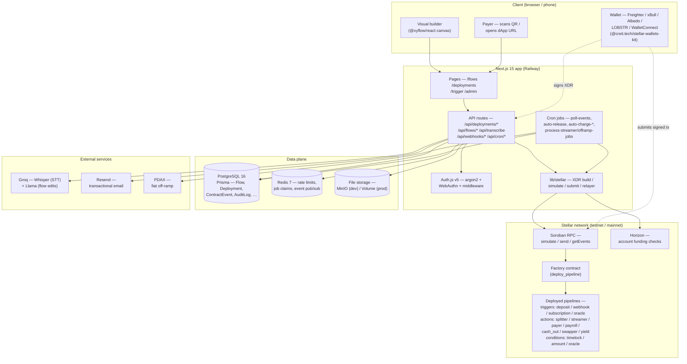
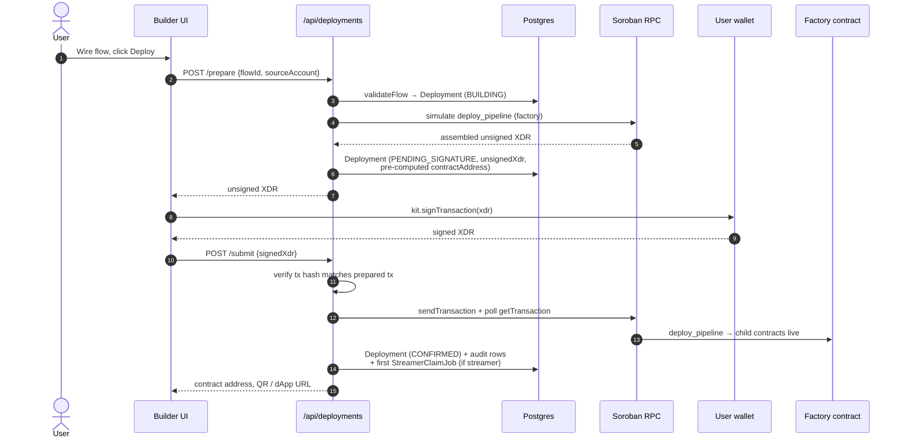
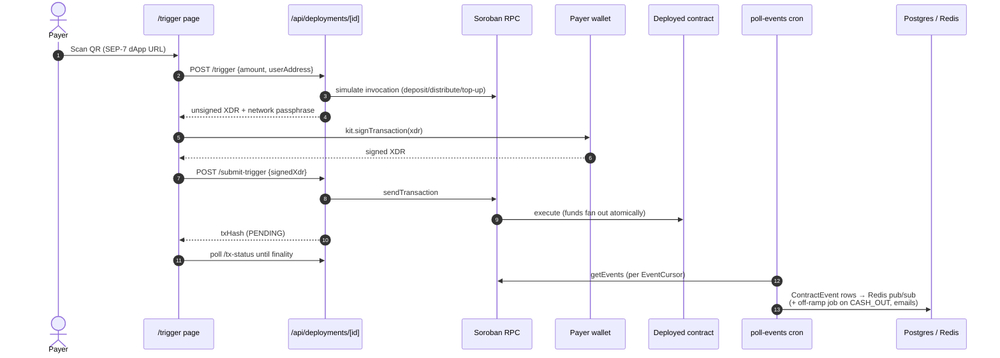
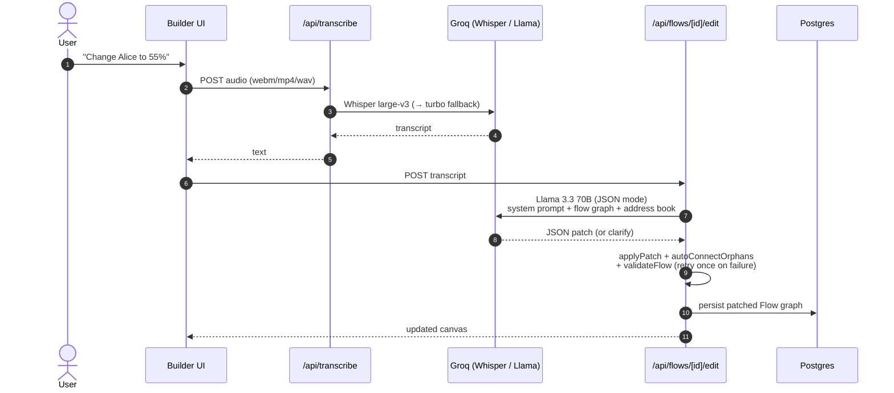
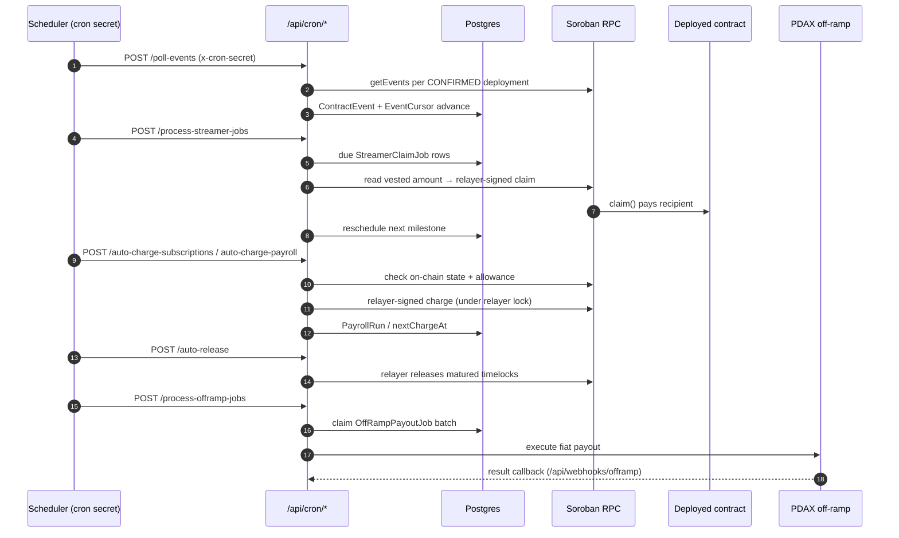

# Architecture diagram sources

Editable mermaid sources for the diagrams embedded in [`../README.md`](../README.md).
The README references the pre-rendered SVGs in [`./diagrams`](./diagrams) so the
diagrams display everywhere (GitHub's client-side mermaid renderer is flaky and
unsupported in the mobile app); the sources are kept here so they stay editable
and still preview as live mermaid where rendering works.

**After editing a diagram here, regenerate the SVG:**

```bash
npx -y @mermaid-js/mermaid-cli -i <diagram>.mmd -o docs/diagrams/<diagram>.svg -b transparent
```

## System architecture



## Sequence — deploy a flow



## Sequence — payer executes via QR



## Sequence — Raft Log voice edit



## Sequence — scheduled automation (cron + relayer)


