# Evidence index

Every artefact produced during the sprint, in one place. Transaction links open on
[stellar.expert](https://stellar.expert/explorer/testnet) and need no account.

**Testnet history is periodically reset.** Where a transaction has been captured, the raw
response is saved alongside it in this directory so the record survives even if the explorer
link stops resolving.

## Contracts

| Item                                   | Value                                                                                                                                                                      | Deliverable |
| -------------------------------------- | -------------------------------------------------------------------------------------------------------------------------------------------------------------------------- | ----------- |
| Swapper WASM hash                      | [`e9482ff0…b23d1a`](https://api.stellar.expert/explorer/testnet/wasm/e9482ff07fcf4791aa3f8deebeda6159081a04f13e8ac63c28e91b7f80b23d1a) — 25,371 bytes, on testnet          | D1          |
| Factory contract                       | [`CBFZTEZZ…ZJNK`](https://stellar.expert/explorer/testnet/contract/CBFZTEZZN2M7PV3LHM5TSHO6K45RDKT4ICX2YUNWRX6RXWVIOJ3KZJNK) — the public app's own factory                | D1          |
| Deposit trigger (9 Sep flow)           | [`CC672N6Z…XYIH`](https://stellar.expert/explorer/testnet/contract/CC672N6Z77E4QEZ2JDEFLGNLVYUS5XS4J3WV7AUP5XVGU3JEVL2XXYIH) — receives the deposit that starts the flow   | D1          |
| Swapper (9 Sep flow)                   | [`CC4AMKQP…ZJWE`](https://stellar.expert/explorer/testnet/contract/CC4AMKQP3JMTUAWP3734PB4BZVWCYC6AYVJLWXQLFSLHK7ACB5UHZJWE) — runs the swapper WASM hash above            | D1          |
| Payer (9 Sep flow)                     | [`CCI5K5UP…VZA5`](https://stellar.expert/explorer/testnet/contract/CCI5K5UPIXJWETFEFBUIMUG6ZKE5LXNUZCAVVBDFAHGE6VTKL5ARVZA5) — forwards the swap proceeds to the recipient | D1          |
| Deposit trigger (recorded 11 Sep flow) | [`CBJE3DVI…Q3IM`](https://stellar.expert/explorer/testnet/contract/CBJE3DVI3753PUZEUGFJWX4AAXUCULU427OMMAQVERB3A7JJRNJRQ3IM)                                               | D1          |
| Swapper (recorded 11 Sep flow)         | [`CBZ53HMV…QA3V`](https://stellar.expert/explorer/testnet/contract/CBZ53HMVYRCJDDTVOJ73SJ6KFXPUGDWU6TPZM4JJYEYIOC5DRRK5QA3V) — same WASM hash                              | D1          |
| Payer (recorded 11 Sep flow)           | [`CC2XTEP2…4ILJ`](https://stellar.expert/explorer/testnet/contract/CC2XTEP2Z2CQS2WCCLLQJSDYZKZX72PWFE7ZOJO37UKHYXIQ3OKE4ILJ)                                               | D1          |
| Soroswap router (testnet)              | [`CCJUD55A…7BRD`](https://stellar.expert/explorer/testnet/contract/CCJUD55AG6W5HAI5LRVNKAE5WDP5XGZBUDS5WNTIVDU7O264UZZE7BRD)                                               | D1          |
| Soroswap XLM/USDC pair                 | [`CCBX3NZT…7RQS`](https://stellar.expert/explorer/testnet/contract/CCBX3NZTCQLQFSPG7HBOKL4P2RVPOPVFHDNRTOSCCJWBTPL2GHEH7RQS) — `token_0` is USDC                           | D1          |
| Deposit trigger (18 Sep D2 flow)       | [`CCO4SUZW…7HT5`](https://stellar.expert/explorer/testnet/contract/CCO4SUZWNBHIPCADMBCLWO4YOSLWFUDDUUMBYCQF6HRHIX3FBHDI7HT5) — receives the deposit the API prepares       | D2          |
| Swapper (18 Sep D2 flow)               | [`CD767KMX…YK46`](https://stellar.expert/explorer/testnet/contract/CD767KMX45WW43PTNBHP2D2MHR4633XVBY53UKIVX5LPZYRTED6RYK46) — same WASM hash as the D1 flows              | D2          |
| Payer (18 Sep D2 flow)                 | [`CDGWKFVY…WRIX`](https://stellar.expert/explorer/testnet/contract/CDGWKFVYWL5Z6QB7KIOBHJLAEK4DGDV7WG4IRMPXWYKCCG76466UWRIX) — forwards the swap proceeds to the recipient | D2          |

The swapper WASM hash is the content hash of the uploaded binary, so it has no explorer page of
its own; the link above downloads the exact bytes from testnet, and the hash also appears on every
deployed swapper's own page, for example [`CC4AMKQP…ZJWE`](https://stellar.expert/explorer/testnet/contract/CC4AMKQP3JMTUAWP3734PB4BZVWCYC6AYVJLWXQLFSLHK7ACB5UHZJWE). Reserves and a live quote can
be re-checked at any time with `pnpm soroswap:check`, which is the gate to run after a Soroswap
testnet reset.

The code entry holding those bytes has its own time-to-live, separate from the instance storage a
contract extends when it runs. It was extended on 12 September to ledger 7742749, roughly 11 March
2027, in [`dd94ca8c…`](https://stellar.expert/explorer/testnet/tx/dd94ca8c6ce4c3606448706afbab902ac7ef1e781434a56fab292eb191975302).
The other nineteen binaries the public app instantiates were extended to the same horizon on the
same day. Most of them renew themselves in normal use — twelve of the twenty contracts call
`extend_ttl` when invoked, which covers the code entry as well as the instance — so the extension
is a precaution for all but two cases: the eight contracts with no such call (the factory, payroll,
yield, multisig, oracle, subscription and its dev variant, and webhook), and templates nobody has
deployed recently, which are never invoked and so never renew. The factory's own instance entry,
which every deploy invokes, was extended on 13 September to ledger 7756749 in
[`9302db7d…`](https://stellar.expert/explorer/testnet/tx/9302db7d72ecaa9f61ba26de36095a098fc363f288cdc155bc8f10e9fa012005). `pnpm contracts:extend-ttl` reports the current figure for any entry and
extends it again.

## Transactions

| Date   | What it proves                                                                                                                           | Deliverable | Transaction                                                                                                                                                                                                                                              |
| ------ | ---------------------------------------------------------------------------------------------------------------------------------------- | ----------- | -------------------------------------------------------------------------------------------------------------------------------------------------------------------------------------------------------------------------------------------------------- |
| 9 Sep  | A swapper flow deployed from paiflow.xyz, through the app's own factory in one `deploy_pipeline` call                                    | D1          | [`775af303…`](https://stellar.expert/explorer/testnet/tx/775af303e24ebd7f59923544df3963cc17fa05e1db66174f38f4c3ae10670943)                                                                                                                               |
| 9 Sep  | 50 XLM swapped to 5.2820859 USDC through the Soroswap router and paid on to the recipient                                                | D1          | [`3bded301…`](https://stellar.expert/explorer/testnet/tx/3bded301fff23b2f34d9ffcfefcb6528de7d594928cdc39a5d261c9dfbf8e927)                                                                                                                               |
| 9 Sep  | 10 XLM swapped to 1.0564010 USDC through the Soroswap router and paid on to the recipient                                                | D1          | [`2ceacb95…`](https://stellar.expert/explorer/testnet/tx/2ceacb95695c5def25ee8c4b84ac44e596d3b936099e3239ef0a9af47164db1b)                                                                                                                               |
| 11 Sep | The recorded run: a sandbox session's swap flow deployed from the builder with a browser wallet                                          | D1          | [`c0460040…`](https://stellar.expert/explorer/testnet/tx/c04600408d910f55639a09b54725f65b38881820bbd468358be6546ce3416f18)                                                                                                                               |
| 11 Sep | The recorded run: 100 XLM swapped to 10.5594796 USDC through the Soroswap router and paid on to the recipient                            | D1          | [`94be52e8…`](https://stellar.expert/explorer/testnet/tx/94be52e8a937b6ddcb85da7cd917f97d412753e5e3ca47ea48b252a264b2278d)                                                                                                                               |
| 15 Sep | Executed through the developer API (`/api/v1`, partner-signed): 10 XLM swapped to 1.0547687 USDC through the Soroswap router and paid on | D2          | [`5b1e738f…`](https://stellar.expert/explorer/testnet/tx/5b1e738fab8b00279e19792d61e8a80eead9b53a4fab021a41ad2088265cb4be)                                                                                                                               |
| 17 Sep | Internal testing of the developer API: two more swapper flows executed through `/api/v1`                                                 | D2          | [`8d8e1d6b…`](https://stellar.expert/explorer/testnet/tx/8d8e1d6b96c615b4ed6f6e8ce40218e07b8b0a38b5694b0fbf31675c7995e2f6) [`cbe539ff…`](https://stellar.expert/explorer/testnet/tx/cbe539ffdfa204ec6b1463bfd1741f9cb2be1caa10e196096e52726faf97a577) |
| 18 Sep | The D2 evidence run, executed through the developer API (`/api/v1`, partner-signed): 10 XLM swapped to 1.0584167 USDC and paid on        | D2          | [`b14e8306…`](https://stellar.expert/explorer/testnet/tx/b14e8306ce55741d19e61b32cae5cef9a9abc04259cf3093fe105f4f1a2fbdf7)                                                                                                                               |
| 18 Sep | The same API driven from the Postman collection rather than curl: 1 XLM swapped to 0.1055731 USDC and paid on                            | D2          | [`27f68188…`](https://stellar.expert/explorer/testnet/tx/27f681889bfebdab92a4d9e6d70770ea5df72bd597c627bc5c0014d0d86bfbfb)                                                                                                                               |

The two 9 September swaps are the same deployed flow triggered twice. [`d1/11-happy-path.json`](d1/11-happy-path.json)
records the deployment, the three contracts the factory produced and the amounts in and out;
[`d1/11-happy-path.getTransaction.json`](d1/11-happy-path.getTransaction.json) is the raw RPC response for both, saved so the record
survives a testnet reset. [`d1/13-recording-run.json`](d1/13-recording-run.json) and
[`d1/13-recording-run.getTransaction.json`](d1/13-recording-run.getTransaction.json) are the same pair for the recorded 11 September run.
The 15 September API swap reuses the first 9 September flow, so it adds a swap transaction but not a new
flow. The 18 September run is D2's evidence swap, on a flow deployed for it; its prepare, submit,
`getTransaction`, events and audit records and the curl transcript are in [`d2/`](d2/README.md).
The second 18 September row is the Postman collection being exercised against the public app: it
runs the same four calls, so importing the collection and driving it produced a real swap rather
than only a passing request. Both 18 September swaps are on the same deployed flow, so they add
swap transactions but not new flows.

The 17 September pair are internal testing rather than evidence — the same API path, on two other
deployments — and are listed here so the record of what ran on the public app is complete. They are
not alpha-round activity and are counted on neither reporting basis.

## Swapper flows executed on testnet

Every deployment from paiflow.xyz whose swapper emitted a `swap` event through the Soroswap
router, from the application's own event records (snapshot of 12 September, details in
[`d1/14-swapper-flows.json`](d1/14-swapper-flows.json)). This is the source of the "unique swapper flows executed" metric.
"judge" and "sandbox" are the QA account and the no-account sandbox sessions.

| #   | Date   | Session                    | Deployment | Swapper contract                                                                                                             | Swap transactions                                                                                                                                                                                                                                                                                                                                                                                                                                                                           |
| --- | ------ | -------------------------- | ---------- | ---------------------------------------------------------------------------------------------------------------------------- | ------------------------------------------------------------------------------------------------------------------------------------------------------------------------------------------------------------------------------------------------------------------------------------------------------------------------------------------------------------------------------------------------------------------------------------------------------------------------------------------- |
| 1   | 09 Sep | admin                      | `0786fca6` | [`CC4AMKQP…ZJWE`](https://stellar.expert/explorer/testnet/contract/CC4AMKQP3JMTUAWP3734PB4BZVWCYC6AYVJLWXQLFSLHK7ACB5UHZJWE) | [`3bded301…`](https://stellar.expert/explorer/testnet/tx/3bded301fff23b2f34d9ffcfefcb6528de7d594928cdc39a5d261c9dfbf8e927) (50 XLM → 5.2820859 USDC) [`2ceacb95…`](https://stellar.expert/explorer/testnet/tx/2ceacb95695c5def25ee8c4b84ac44e596d3b936099e3239ef0a9af47164db1b) (10 XLM → 1.0564010 USDC) [`5b1e738f…`](https://stellar.expert/explorer/testnet/tx/5b1e738fab8b00279e19792d61e8a80eead9b53a4fab021a41ad2088265cb4be) (10 XLM → 1.0547687 USDC, via `/api/v1`, 15 Sep) |
| 2   | 10 Sep | judge                      | `44c3ed53` | [`CBWGUCYL…LI7M`](https://stellar.expert/explorer/testnet/contract/CBWGUCYLFBALLEC6GPSJBPSRYVLLBHCC7DEQJIB2T2TG4INW4AQ5LI7M) | [`8d870722…`](https://stellar.expert/explorer/testnet/tx/8d8707228a6b1d30b01dd2f5c6d956961f090cd9cd690c73d994f7a8a4ec8f3f) (10 XLM → 1.0563957 USDC)                                                                                                                                                                                                                                                                                                                                        |
| 3   | 10 Sep | judge                      | `8d184c20` | [`CCYBEFR2…YQKX`](https://stellar.expert/explorer/testnet/contract/CCYBEFR2SLHQJPQI7XUCRT5LERFAXW6WQYAGJK72IZTDIFLCWL7SYQKX) | [`9f7fa585…`](https://stellar.expert/explorer/testnet/tx/9f7fa585eac0f8b11cf3dee864438d6c078b1673d52c2c7584b56746e7a4aa4b) (100 XLM → 10.5636628 USDC)                                                                                                                                                                                                                                                                                                                                      |
| 4   | 10 Sep | sandbox                    | `b13a9535` | [`CAOURKT5…7LOJ`](https://stellar.expert/explorer/testnet/contract/CAOURKT5YX24LS7TSEIFBDG5IYPAMGZA5HTLYZ5LWW73MIGO7M577LOJ) | [`baed3c00…`](https://stellar.expert/explorer/testnet/tx/baed3c00d905467baa369d0d14573226ce587b21b030ddad028f05f3837bcba6) (10 XLM → 1.0562831 USDC)                                                                                                                                                                                                                                                                                                                                        |
| 5   | 11 Sep | sandbox                    | `a89b6e6d` | [`CAYBCCAQ…7SKO`](https://stellar.expert/explorer/testnet/contract/CAYBCCAQ72CFJH6U3ZYZNNRGLEMSH4LAVZBRXMN5FLKXZWPIE5RZ7SKO) | [`4e717097…`](https://stellar.expert/explorer/testnet/tx/4e71709730f3e5f29737c77b1ce4db1a270f2997537d2fc094ca73b23a20614f) (10 XLM → 1.0561648 USDC)                                                                                                                                                                                                                                                                                                                                        |
| 6   | 11 Sep | sandbox                    | `7d784ee1` | [`CD4GKMF5…6KFZ`](https://stellar.expert/explorer/testnet/contract/CD4GKMF5N2IX5RLFBCE5F3X4CAPD4M5BIIF5OOCVXAYWYMW5DYZQ6KFZ) | [`957f9bc8…`](https://stellar.expert/explorer/testnet/tx/957f9bc89c21821a61c7594010d1e957a91a24166449a381a779e793ce139349) (100 XLM → 10.5613545 USDC)                                                                                                                                                                                                                                                                                                                                      |
| 7   | 11 Sep | sandbox                    | `eb3aa100` | [`CAS57DDJ…RVKO`](https://stellar.expert/explorer/testnet/contract/CAS57DDJDLW3VRKMMYK5IPQWLC6KQEQBA7PI5KZR2PJT4BI4SS5IRVKO) | [`d393d248…`](https://stellar.expert/explorer/testnet/tx/d393d24844103fc6678f52dc6bb16a1a36296b4ffba447033e9c6471dc62332f) (50 XLM → 5.2803423 USDC)                                                                                                                                                                                                                                                                                                                                        |
| 8   | 11 Sep | sandbox                    | `2a419805` | [`CD3I26JV…DX3Z`](https://stellar.expert/explorer/testnet/contract/CD3I26JV527M3GV3RR2Y2CUCHGP3SE4UDT2RQ7AJ7EINUNFXBQ2QDX3Z) | [`079c7516…`](https://stellar.expert/explorer/testnet/tx/079c7516ebdc2f71c7a659af5460ac8b51def0fd33d9307d806b1b4c6b4ba55e) (50 XLM → 5.2802084 USDC) [`1327d15f…`](https://stellar.expert/explorer/testnet/tx/1327d15f9c8008d8f529540dae82511a85f25b9b85d25356dea587ff3b744e77) (50 XLM → 5.2800745 USDC) [`cf401926…`](https://stellar.expert/explorer/testnet/tx/cf4019268431d6b399b1badbc315495792d4c6ff2dbdc9a1673cc32b23819fe4) (50 XLM → 5.2799405 USDC)                        |
| 9   | 11 Sep | sandbox (the recorded run) | `992a754f` | [`CBZ53HMV…QA3V`](https://stellar.expert/explorer/testnet/contract/CBZ53HMVYRCJDDTVOJ73SJ6KFXPUGDWU6TPZM4JJYEYIOC5DRRK5QA3V) | [`94be52e8…`](https://stellar.expert/explorer/testnet/tx/94be52e8a937b6ddcb85da7cd917f97d412753e5e3ca47ea48b252a264b2278d) (100 XLM → 10.5594796 USDC)                                                                                                                                                                                                                                                                                                                                      |
| 10  | 11 Sep | sandbox                    | `27b4c2e9` | [`CBXLZKQU…XKRE`](https://stellar.expert/explorer/testnet/contract/CBXLZKQUZIBQ4JO7JU74N2F57JRKHLKH7QIQKRXUA5IBMQOH2TCTXKRE) | [`590128ed…`](https://stellar.expert/explorer/testnet/tx/590128ed492ac9da010d0d63110cfcd120c62ca7dc1542728fca084501f56135) (1000 XLM → 105.5653820 USDC)                                                                                                                                                                                                                                                                                                                                    |
| 11  | 11 Sep | sandbox                    | `f8269f58` | [`CCQUJUM3…G4YR`](https://stellar.expert/explorer/testnet/contract/CCQUJUM3GTE6BCZHPTPLW5SC4WC7JIJMOGYK6Y4WWOXMPY5ZWBTYG4YR) | [`b36bb060…`](https://stellar.expert/explorer/testnet/tx/b36bb06098966ac2c7274be08dbca5465d6e8941e32c4298d3d16c5fb56fa5be) (100 XLM → 10.5535904 USDC) [`a6331c04…`](https://stellar.expert/explorer/testnet/tx/a6331c0456acd76727479a418ac06571ebf1a612f1bfa17ff533ceff6f5a7381) (100 XLM → 10.5530552 USDC)                                                                                                                                                                            |
| 12  | 11 Sep | sandbox                    | `8feb8e75` | [`CA3WPY3B…DX5H`](https://stellar.expert/explorer/testnet/contract/CA3WPY3BMHUI5MXQKRUGJE4ZZ22I2GUG7NUPVSAOIDTAIPJ7XUKTDX5H) | [`8ebe2275…`](https://stellar.expert/explorer/testnet/tx/8ebe22756cf53cc19a992e2ad926fb279c660771662cc6589ab3731371b47ada) (100 XLM → 10.5525201 USDC)                                                                                                                                                                                                                                                                                                                                      |
| 13  | 11 Sep | sandbox                    | `bf9ef099` | [`CCJZ3XMB…IQ3D`](https://stellar.expert/explorer/testnet/contract/CCJZ3XMB4ULW5GHTDPBMFSNSIAO3EHKWYJWR5EXYCDDIPS67GJQAIQ3D) | [`6ab282e3…`](https://stellar.expert/explorer/testnet/tx/6ab282e31fd24422ac1d647bdba3ff2124c597e2659b945a026cde3aa659265e) (100 XLM → 10.5519851 USDC)                                                                                                                                                                                                                                                                                                                                      |
| 14  | 11 Sep | sandbox                    | `122213b2` | [`CCWS5BMF…45GR`](https://stellar.expert/explorer/testnet/contract/CCWS5BMFMFZ6GGBI55CXU36OBHUBEPL3ZZB5OAISSESJS74VUKT445GR) | [`bca93ce6…`](https://stellar.expert/explorer/testnet/tx/bca93ce69b1592fc477d3f9f5735ab3eaf6a15293f75dbd01d84946e945b71cb) (100 XLM → 10.5514500 USDC)                                                                                                                                                                                                                                                                                                                                      |
| 15  | 11 Sep | sandbox                    | `e7965d6a` | [`CD2KQNHM…5MDF`](https://stellar.expert/explorer/testnet/contract/CD2KQNHMOQHFSPS5RYDZLTG7NHDO2Y6VQRF2UFCIRS6Y5KTOWJWN5MDF) | [`838373ba…`](https://stellar.expert/explorer/testnet/tx/838373ba332a7a2077c38af523816a6ded49805834fde1f6331c4e380281961d) (1000 XLM → 105.4851198 USDC)                                                                                                                                                                                                                                                                                                                                    |
| 16  | 11 Sep | sandbox                    | `3090cd4b` | [`CDKUIRIA…7LHE`](https://stellar.expert/explorer/testnet/contract/CDKUIRIABBD7RELDHG74Y4DJCS3YOY4OPMZVVJRFZF27A4LMFZJZ7LHE) | [`8a07ac54…`](https://stellar.expert/explorer/testnet/tx/8a07ac5445f19a26388554c32b26d251e965890d33132fe6cb78b26edd968190) (10 XLM → 1.0540171 USDC)                                                                                                                                                                                                                                                                                                                                        |

Every one of these transactions carries the `SoroswapRouter / swap` event from
`CCJUD55A…7BRD`; the checks in the next section apply to each.

## How to verify the router

The Statement of Work asks for a swap executed through **the Soroswap router**. Two things have to
hold: that the transaction called that contract, and that the contract is Soroswap's rather than
one of ours. Each link is checkable without an account, and all four are recorded in
[`d1/11-soroswap-router-proof.json`](d1/11-soroswap-router-proof.json).

**The address is Soroswap's, by their own publication.** Soroswap lists its testnet deployment in
[`soroswap/core` → `public/testnet.contracts.json`](https://raw.githubusercontent.com/soroswap/core/main/public/testnet.contracts.json):
router `CCJUD55A…7BRD`, factory `CDP3HMUH…JTBY`. That is the address Paiflow pins as
`STELLAR_SOROSWAP_ROUTER_TESTNET` and injects at deploy time; it is never read from a flow graph,
so a flow cannot point itself at a different "router".

**The deployed code is Soroswap's, byte for byte.** The same file publishes a code hash per
contract. They match what is actually on testnet:

| Contract      | Published by Soroswap | Deployed on testnet |
| ------------- | --------------------- | ------------------- |
| Router        | `4b95bbf9…824c`       | `4b95bbf9…824c`     |
| Factory       | `86285a92…2993`       | `86285a92…2993`     |
| XLM/USDC pair | `8447525e…a464`       | `8447525e…a464`     |

**The transaction called it.** The diagnostic trace inside [`2ceacb95…`](https://stellar.expert/explorer/testnet/tx/2ceacb95695c5def25ee8c4b84ac44e596d3b936099e3239ef0a9af47164db1b)
shows the Paiflow swapper `CC4AMKQP…ZJWE` invoking `swap_exact_tokens_for_tokens` on
`CCJUD55A…7BRD`, and the router in turn calling `get_reserves` and `swap` on the pair and
`transfer` on the XLM contract — 10 XLM in, 1.0564010 USDC out — before returning successfully.
The recorded run's [`94be52e8…`](https://stellar.expert/explorer/testnet/tx/94be52e8a937b6ddcb85da7cd917f97d412753e5e3ca47ea48b252a264b2278d)
has the same trace from `CBZ53HMV…QA3V`.

**The events corroborate it.** The router emits `SoroswapRouter / swap` and the pair emits
`SoroswapPair / swap` and `sync`. Those symbols are compiled into Soroswap's binaries; Paiflow
cannot emit them. Every one is marked as part of a successful contract call, and the transaction
itself succeeded, so this is applied ledger state and not a simulation.

On the explorer, the quickest check is the transaction's event list: the `SoroswapRouter / swap`
entry names `CCJUD55A…7BRD` as the contract that emitted it, and that contract's own page shows
the code hash to compare against Soroswap's file.

## Screenshots and recordings

All captured from [paiflow.xyz](https://paiflow.xyz) itself, not a development environment.

| Item                                                   | Deliverable | File                                                                                                                |
| ------------------------------------------------------ | ----------- | ------------------------------------------------------------------------------------------------------------------- |
| **Screen recording of deploy and trigger** (11 Sep)    | D1          | [Google Drive, `ScreenRec.mp4`](https://drive.google.com/file/d/1hcaNcojXrLmEYmTEHrNavQ_Wu9xgqaHL/view?usp=sharing) |
| Swap block on the canvas, palette and English preview  | D1          | [`d1/01-builder-swap-flow.png`](d1/01-builder-swap-flow.png)                                                        |
| Swapper config panel: router, slippage, deadline       | D1          | [`d1/02-swap-panel-after.png`](d1/02-swap-panel-after.png)                                                          |
| Error: `assetIn` does not match the incoming asset     | D1          | [`d1/03-error-asset-mismatch.png`](d1/03-error-asset-mismatch.png)                                                  |
| Error: more than one outgoing edge                     | D1          | [`d1/04-error-two-edges.png`](d1/04-error-two-edges.png)                                                            |
| Error: both sides of the swap are the same asset       | D1          | [`d1/06-error-same-asset.png`](d1/06-error-same-asset.png)                                                          |
| Deploy review with the TESTNET chip and the live quote | D1          | [`d1/07-deploy-review.png`](d1/07-deploy-review.png)                                                                |
| Live Soroswap quote in the config panel                | D1          | [`d1/08-swap-panel-live-quote.png`](d1/08-swap-panel-live-quote.png)                                                |
| Live quote on the builder canvas                       | D1          | [`d1/09-builder-live-quote.png`](d1/09-builder-live-quote.png)                                                      |
| Swapper config panel as it was **before** D1 (9 Sep)   | D3          | [`d3/02-swap-panel-before.png`](d3/02-swap-panel-before.png)                                                        |
| Builder with the pre-D1 swap node selected (9 Sep)     | D3          | [`d3/01-builder-before.png`](d3/01-builder-before.png)                                                              |
| Palette before the Swap block was unhidden (9 Sep)     | D3          | [`d3/00-palette-before.png`](d3/00-palette-before.png)                                                              |

The recording is the journey the SOW asks for, made on paiflow.xyz through the no-account
sandbox: build `Receive XLM → Swap → Pay USDC` in the builder, deploy it with a browser wallet,
and fund the trigger. It shows the outcome by the recipient's USDC balance before and after the
trigger rather than by opening the explorer; the transaction behind it is
[`94be52e8…`](https://stellar.expert/explorer/testnet/tx/94be52e8a937b6ddcb85da7cd917f97d412753e5e3ca47ea48b252a264b2278d)
(100 XLM → 10.5594796 USDC), deployed by
[`c0460040…`](https://stellar.expert/explorer/testnet/tx/c04600408d910f55639a09b54725f65b38881820bbd468358be6546ce3416f18),
with the raw records in [`d1/13-recording-run.json`](d1/13-recording-run.json) and [`d1/13-recording-run.getTransaction.json`](d1/13-recording-run.getTransaction.json).

The D1 and D3 panel shots are the two halves of the same comparison. Before: `Asset In`,
`Asset Out` and a raw `Rate (basis points, 1–10000)`. After: the same two assets plus a
read-only `Soroswap (testnet)` router, `Max slippage (%)`, `Deadline (seconds)` and a live
quote reading `10 XLM → ~1.0564 USDC`.

### The captures

Each screenshot in the table, in order. Every one was taken from paiflow.xyz.

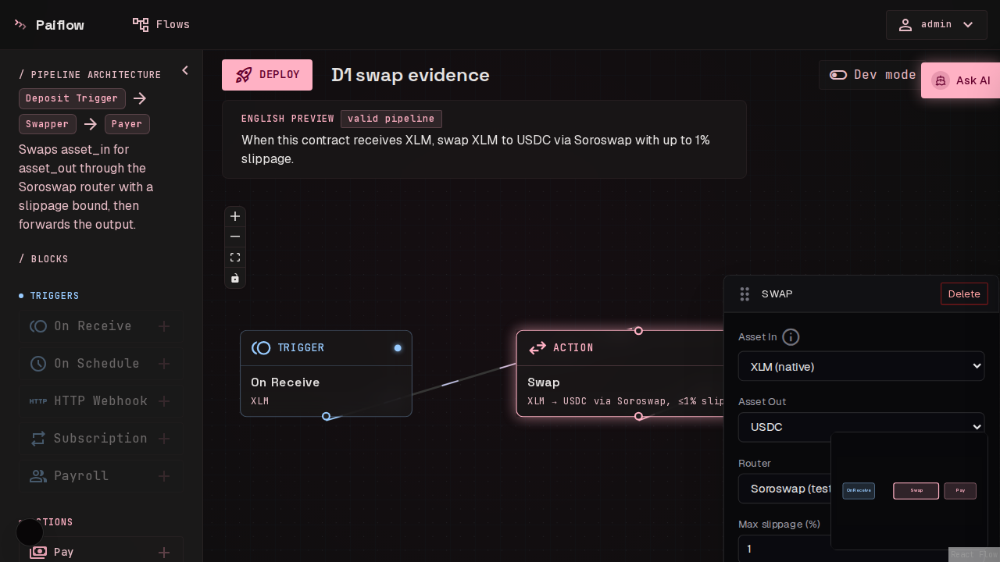

_Swap block on the canvas, with the palette and the English preview._

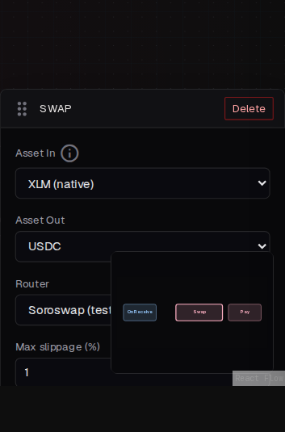

_Swapper config panel: read-only Soroswap router, max slippage, deadline._

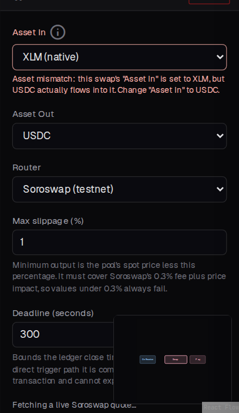

_Validation error: the swap's asset in does not match the incoming asset._

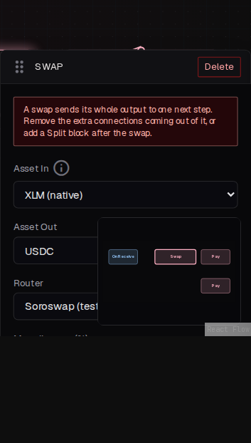

_Validation error: a swap block with more than one outgoing edge._

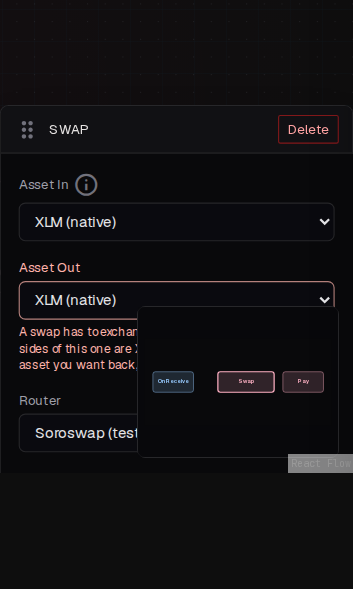

_Validation error: both sides of the swap are the same asset._

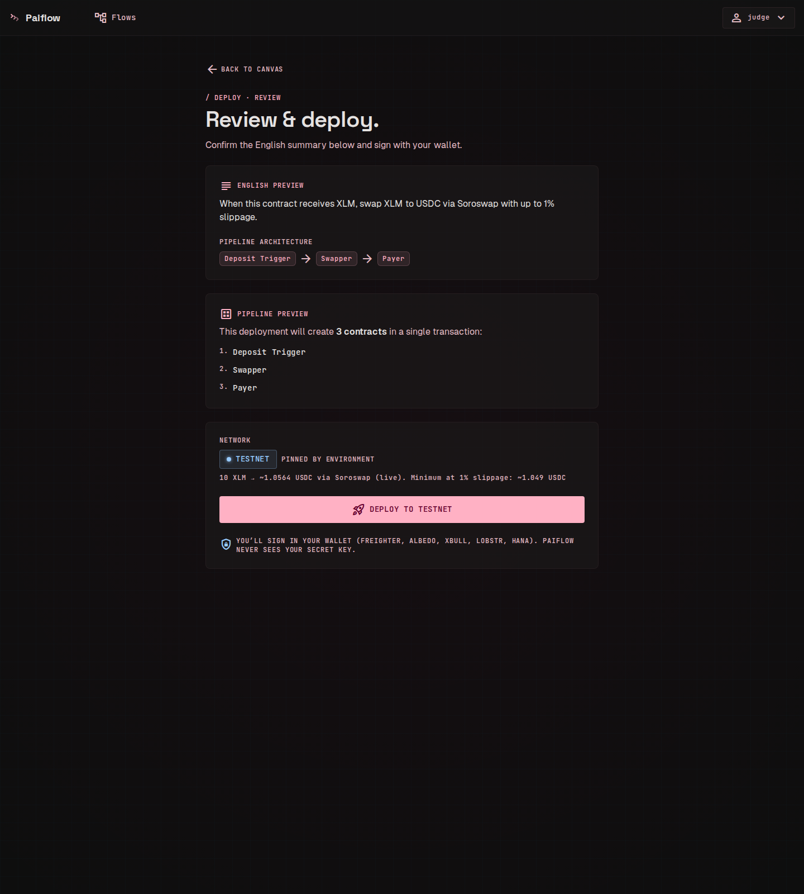

_Deploy review with the TESTNET chip and the live quote._

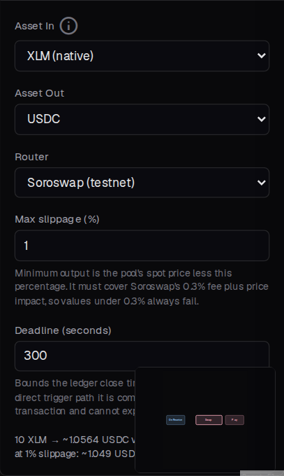

_Live Soroswap quote in the config panel._

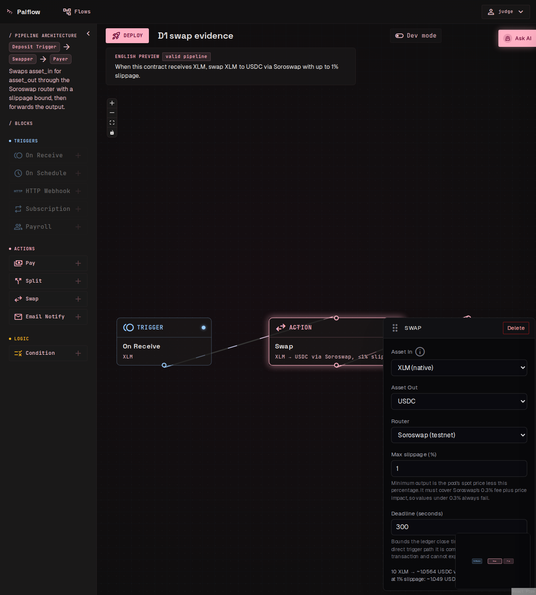

_Live quote on the builder canvas._

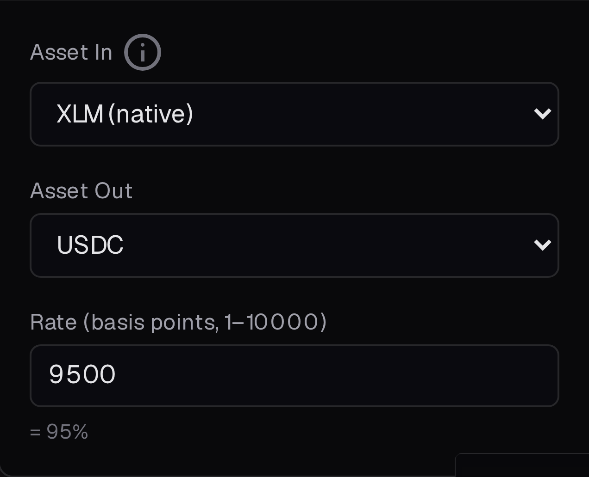

_Before D1: the swapper panel with a raw rate field (9 Sep)._

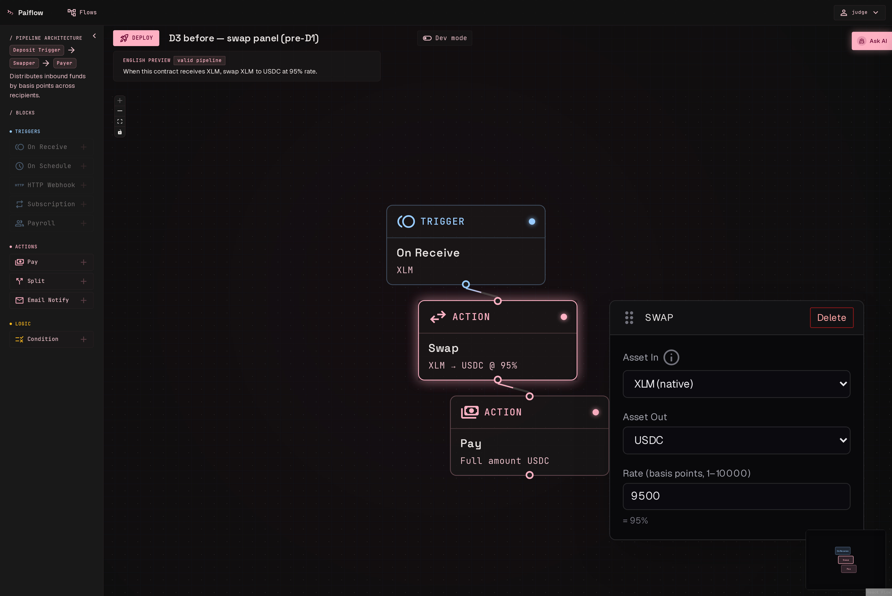

_Before D1: the builder with the old swap node selected (9 Sep)._

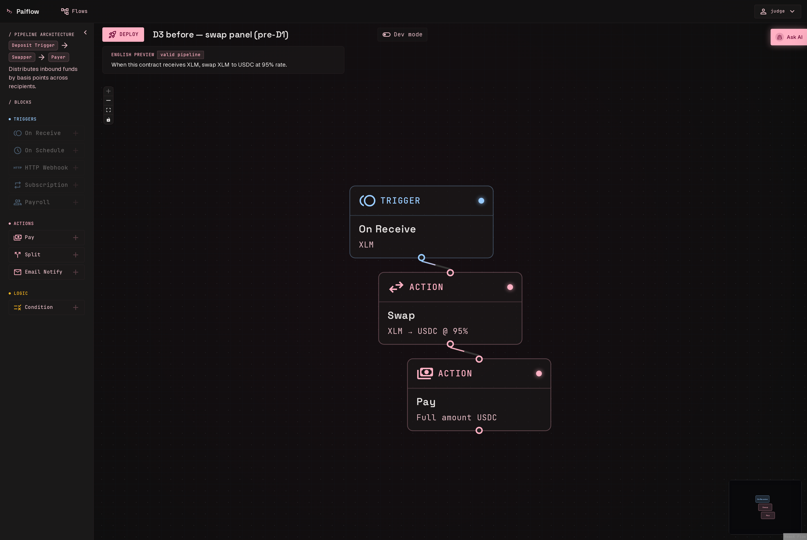

_Before D1: the palette without the Swap block (9 Sep)._

## API samples

Request and response pairs recorded against the public app.

| Item                                                       | Deliverable | File                                                                 |
| ---------------------------------------------------------- | ----------- | -------------------------------------------------------------------- |
| `slippageBps` outside 0–10000 rejected at the API boundary | D1          | [`d1/05-error-slippage-range.json`](d1/05-error-slippage-range.json) |
| `deadlineSecs` below 1 rejected at the API boundary        | D1          | [`d1/06-error-deadline.json`](d1/06-error-deadline.json)             |
| Live Soroswap quote endpoint response                      | D1          | [`d1/10-quote-endpoint.json`](d1/10-quote-endpoint.json)             |

The quote sample is a real answer from the public app: 10 XLM quotes at `10564278` stroops of
USDC with a `10490132` minimum at 1 % slippage, through pair `CCBX3NZT…7RQS` on router
`CCJUD55A…7BRD`.

## Metrics snapshots

| Date   | File                                                                       | Source                                                                                           |
| ------ | -------------------------------------------------------------------------- | ------------------------------------------------------------------------------------------------ |
| 11 Sep | [`metrics-2026-09-11.json`](metrics-2026-09-11.json)                       | Read-only query on the public app's database; each figure carries its definition                 |
| 12 Sep | [`metrics-2026-09-12.json`](metrics-2026-09-12.json)                       | Same query, re-run at the close of week 1; each figure also carries its target                   |
| 17 Sep | [`alpha-metrics-2026-09-17.json`](alpha-metrics-2026-09-17.json)           | PostHog HogQL over the issued alpha-tester ids; first cohort snapshot                            |
| 18 Sep | [`alpha-metrics-2026-09-18.json`](alpha-metrics-2026-09-18.json)           | The same, after the second tester finished                                                       |
| 18 Sep | [`metrics-live-2026-09-18.json`](metrics-live-2026-09-18.json)             | The first read of the **live** database, the one the app has used since the 16 September cutover |
| 18 Sep | [`swapper-flows-live-2026-09-18.json`](swapper-flows-live-2026-09-18.json) | `--flows` against the same database: 11 executed swapper flows, 17 swap transactions             |

The `metrics-*` files are the output of `pnpm instawards:metrics` and the `alpha-metrics-*` files
of `pnpm instawards:alpha-metrics`, so any figure here can be recomputed with the same definitions.

**Two databases, and each snapshot says which it read.** The 11 and 12 September files are the
Postgres now kept as `postgres-staging-archive`, frozen at the 16 September cutover. The
18 September live file is the database the application uses now. They hold different rows and are
never added together; [metrics](../metrics.md#counting-rules) explains why.

## Scope

Only transactions produced from [paiflow.xyz](https://paiflow.xyz) during the sprint are
listed here, and only those count toward the [metrics](../metrics.md).
